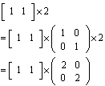

# 从数据到你的眼
# 一 模型
通过一个向量[1,1,1]我们可以描述一个点在坐标系中的位置，所以，向量和点的意义相同
通过两个点，可以得到一条线，所以我们可以用两个向量来表述一条线
而通过三个点的信息，我们可以表述一个平面

所以一个三角形平面的可以表示为
```
[
    [x0,y0,z0],
    [x1,y1,z1],
    [x2,y2,z2]
]
```
如果想要得到一个立体物体的模型，我们需要很多很多的平面。如下



平面越多，要表示的物体越精致。

建模的过程，也就是将物体用 若干个“点组成的低多边形平面”表示的的过程

也就是 模型 = 点 + 点的组合关系

# 二 投影
人并不能看到三维物体的全部，智能看到三维物体的反光，在视网膜上的二维投影

计算机也只能将三维的信息，转换成二维的图片，显示给用户

所以在成像，之前，需要对模型数据，进行投影计算


如图o为眼睛的位置，中间平面为屏幕（视口）的位置

o(0,0,0)<br>
p(0,0,c)<br>
X(x,y,z)

m = (x*c/z, y*c/z, c)<br>
得到投影坐标后，抛弃第三个维度，得到m在屏幕平面上的坐标(xc/z, yc/z);

# 三 颜色
得到所有点在屏幕平面上的位置信息后，我们也还是没有办法看到物体。

我们能够看见物体，是由于我们能够看见物体反射的光

## RGB
由于人眼睛的生理结构，一般能够接受红，绿，蓝三种颜色信号<br>
可以想象成眼睛里面有三种接收器，分别能够感应红绿蓝三种颜色的光<br>
我们看到的所有颜色，都是红蓝绿的不同比例在大脑中计算后的综合结果<br>

于是,人们设计了RGB这种表示颜色的方式
>即通过红绿蓝的配比来表示颜色,值的大小表示颜色的深浅


## 镜面反射
只有当眼睛（摄像机）位于反射方向上，才能看见光
入射角与反射角相等



## 漫反射
如果物体，发生均匀漫反射，那么进入眼睛的光的强度这样表示<br>
>a = 眼睛与出射光的夹角<br>
入眼的光 = 原光 x cos(a)


# 三 光栅化
得到

# 四 成像

# 五 变换


# 一 位置
## 向量与点
如图 点(3,6)和点(3,4)可以看做是<br>
原点(0,0)+向量(3,6) = 点(3,6)<br>
原点(0,0)+向量(3,4) = 点(3,4)<br>
所以，可以把向量看成是点的等价物，为方便表述，后续用```v_```开头代表向量


## 平移变换

点A(1,1) 以向量a(2,1) 平移 <br>
(1,1) + (2, 1) = (3,2) 如图


## 线性变换
### 矩阵的意义
一个2x2的矩阵可以看成是两个2维向量的从上而下的排列<br>


上面矩阵可以看做是
v_a(2,1) 和 v_b(3,3)的组合

每个点或者说向量，可以化成一个向量和一个矩阵乘积


>在这里面，向量的每一个元素代表在一个方向上的大小，而矩阵的每一行代表一个方向

### 缩放
如果将途中三角形放大一倍，A(1, 1), B(2, 0) O(0, 0);


A的点的变换过程如下



由此得到以原点为中心放大一倍的变换矩阵为


在这里可以看做是将每个方向向量扩大一倍


### 旋转
如图将 x和五角星 逆时针旋转45度 <br>
点x(2, 1) <br>
点p(3, 3) <br>


点x可以换成下面的表示方法


逆时针旋转45度后，可以看做是<br>
从(1,0)方向上的积累换到了(1,1)方向上的积累 <br>
从(0,1)方向上的积累换到了(-1,1)方向上的积累<br>

把向量(1,1)(-1,1)转化成为单位向量,得到点x的变换公式为


变换矩阵为


同理可以得到点P旋转后的坐标为(0, 3sqrt(2)) <br>
以上方法都可以推导至三维空间

二纬空间的旋转公式




### 线性变换的定义
线性变换是一种特殊的映射关系，需满足
>f(x1+x2) = f(x1) + f(x2) <br>
既像的和等于和的像

例如 f(x) = 2x 是线性变换 <br>
而 f(x) = 2x+1 不是线性变换

## 仿射变换

### 高维度的放射变换模拟低维度的放射变换


# 二 颜色


## 漫反射与环境光

如果物体表面发生均匀的漫反射，进入眼球的光，等于
