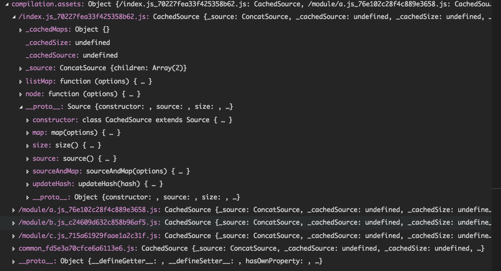

# webpack 插件开发

## apply入口
webpack插件实例应当是一个具有apply方法的对象，webpack会在执行过程中调用插件实例的apply方法， 并将compiler作为入参传入
``` js
class SplitChunks {
    constructor(options) {
    }
    apply(compiler) {
        //插件逻辑
    }
}
```

## compiler
compiler包含了webpack所有的配置信息， ```options```, ```loaders```, ```plugins```等<br>

webpack中的对象都继承了[Tapable](https://github.com/webpack/tapable)(一个pubsub模式的类),因此，compiler也继承了Tapable的方法。
可以使用```plugin```方法订阅webpack编译过程中的事件

```
compiler.plugin("compilation", function(compilation) {
    // compilation事件节点逻辑
});
```

- 关键事件列表
    - run （开始构建compilation）
    - compilation (一个compilation被创建)
    - compile （编译器开始编译）
    - after-compile （编译结束）
    - emit （开始封装）

## compilation
- compilation大概包含
    - addModule等编译时需要的方法（环境）
    - modules chunks等编译过程中产生的对象 （数据）

compilation也是一个继承了Tapable的实例，订阅compilation中事件的手法与compiler中一致
```
compilation.plugin('optimize-tree', (chunks, modules, cb) => {
    ...
    // 异步事件需要在执行逻辑后手动调用callback
    cb()
});
```

- 关键事件列表
    - optimize （编译优化开始）
    - optimize-tree（优化树过程完毕）
    - optimize-assets （优化生成资源）
    - seal （开始封装）


## 实例一：切割chunks插件实例
下面通过一个实例讲解一下

插件的功能： 将每一个模块当做一个chunk输出，解决大bundle在细粒度缓存和http2上的劣势

插件使用前：  entry -> bundle

插件使用后： entry -> moduleA, moduleB, moduleC  

首先看一下编译过程[chunk如何生成](https://github.com/webpack/webpack/blob/master/lib/Compilation.js#L574-L605)

按照源码中生成chunk的过程，先将已生成的chunk清空，重新生成自己需要的chunk

``` javascript
/**
 * author by tangyan
 */
"use strict";

let path = require('path');

class SplitChunks {
    constructor(options) {
    }

    apply(compiler) {
        var root = path.resolve(__dirname, '../');
        compiler.plugin("compilation", (compilation, data) => {

            compilation.plugin('optimize-tree', (chunks, modules, cb) => {

                // 清空所有chunks
                chunks.splice(0, chunks.length);

                // 把common chunk移回来
                chunks.push(compilation.namedChunks.common);
                
                // 按module建立chunk
                modules.forEach(m => {

                    // 将module的路径设置为名字
                    var name = m.resource.replace(root, '');

                    // 根据名字创建chunk
                    var chunk = compilation.addChunk(name, m)
                    chunk.id = name.replace(/\//g,"_");//路径分割都换成下划线,以免webpackJSONP报错
                    chunk.isInitial(true);
                    chunk.entryModule = m;
                    chunk.filenameTemplate = name+ '_[chunkhash].js'

                    // 建立一个自定义属性oneByone 一一对应chunk和module
                    chunk.oneByone = m;
                    m.oneByone = chunk;

                    // 建立护指
                    chunk.addModule(m);
                    m.addChunk(chunk);

                    // module 的id改成与那么相同，以免数字排序
                    m.id = name;
                })
                cb();
            })

        });
    }
}

module.exports = SplitChunks;
```

## 实例二：生成依赖表
插件功能： 生成每个模块的依赖表

【原理】在输出文件前，会现在compilation实例下生成assets对象。

其中存储了所有要输出的内容，可以在输出内容前修改assets对象来控制输出内容。

我们来看下assets的结构


最后的输出内容实际是source方法的返回值
``` javascript
/**
 * author by tangyan
 */
"use strict";

let path = require('path');

class DepMap {
    constructor(options) {
    }

    chunkToDeps(chunk) {
        try{
            return chunk.oneByone.dependencies;
        }catch(e) {
            return [];
        }
    }

    depToChunk(dep) {
        return dep.module.oneByone
    }

    getfilename(chunk) {
        return chunk.files[0];
    }

    // 递归获取依赖
    getDeps(chunk, dependencies) {
        var self = this;
        dependencies = dependencies || [];
        var deps = self.chunkToDeps(chunk);
        deps.forEach(d => {
            if(d.module) {
                var c = self.depToChunk(d);
                var cName = self.getfilename(c);

                // 检查依赖是否已经引入，避免循环依赖
                if(dependencies.indexOf(cName) >=0) {

                }else {
                    dependencies.push(cName);
                    self.getDeps(c, dependencies);
                }
            }
        });
        return dependencies;
    }

    apply(compiler) {
        var self = this;
        var root = path.resolve(__dirname, '../');

        // 所有assets准备就绪，最后添加assets的时机
        compiler.plugin("emit", (compilation, cb) => {
            var dep = {};
            compilation.chunks.forEach(chunk => {
                var name = self.getfilename(chunk);
                dep[name] = self.getDeps(chunk);
            })

            var depMap = JSON.stringify(dep, null, 4);


            compilation.assets['depmap.json'] = {
                // source方法返回值为最终输出内容
                source() {
                    return depMap
                },
                size() {
                    return depMap.length
                }
            }
            cb();
        });
        
    }
}

module.exports = DepMap;

```

## webpack 插件API手册（能做的事情还有很多。。。）
http://www.css88.com/doc/webpack2/api/plugins/
